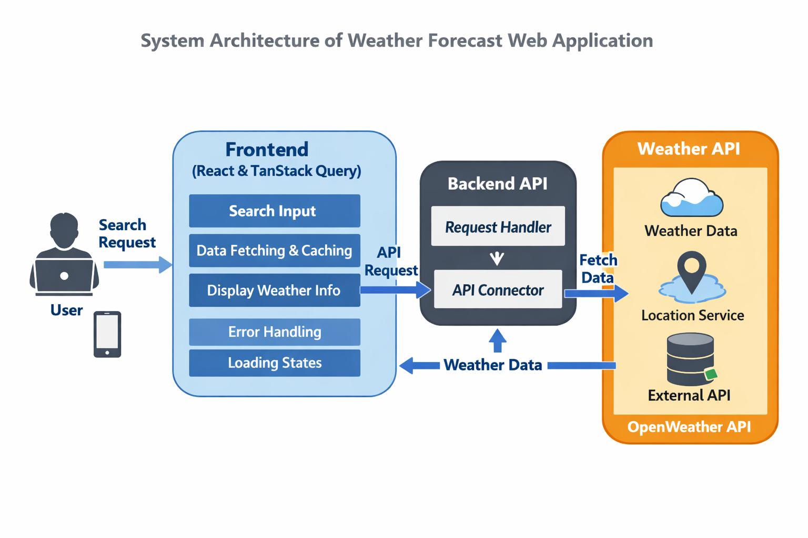
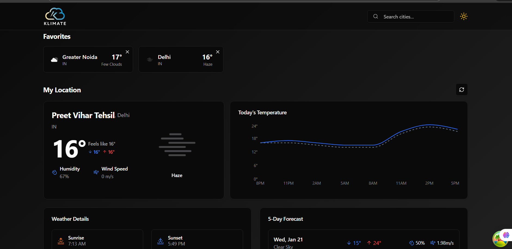
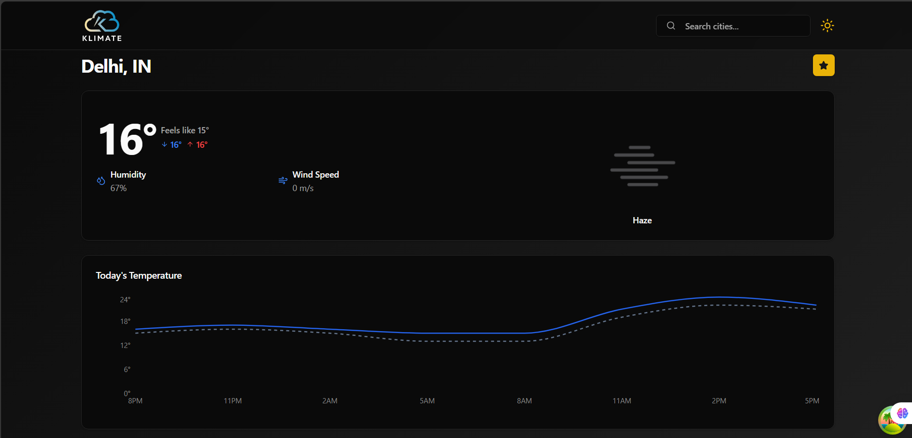
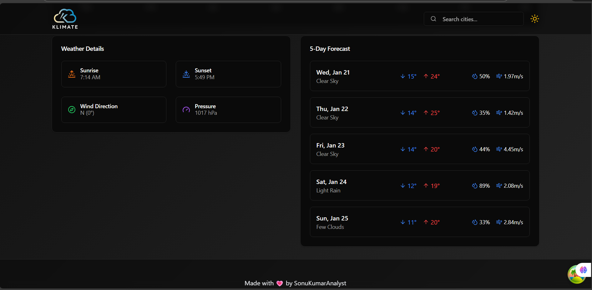

# 🌦️ Weather Forecast Web Application

[](https://react.dev/)
[](https://tanstack.com/query)
[](https://vitejs.dev/)
[](https://openweathermap.org/)
[](#)

---

## Description

The Weather Forecast Web Application is a web-based system developed using React and TanStack Query.  
It provides real-time weather information for a user-specified city by integrating the OpenWeatherMap API.  
The application focuses on performance, clean user interface, and efficient data fetching using caching mechanisms.

---

## Features

- City-based weather search
- Real-time temperature and weather conditions
- Efficient API data fetching using TanStack Query
- Loading and error state handling
- Responsive user interface

---

## Technologies Used

- React.js
- TanStack Query
- Vite
- JavaScript (ES6)
- OpenWeatherMap API
- HTML5, CSS3

---

## System Architecture

The application follows a client-server architecture.

1. User enters a city name
2. React frontend sends request using TanStack Query
3. OpenWeatherMap API processes the request
4. Weather data is returned and cached
5. Data is displayed on the user interface

### Architecture Diagram



---

## Project Screenshots

### Home Page


### Weather Information Display



---

## Installation and Setup

1. Clone the repository
   ```bash
   git clone https://github.com/SonuKumarAnalyst/tanstack-query-weather-app.git

2. Navigate to the project directory
   ```bash
   cd tanstack-query-weather-app
   
3. Install dependencies
   ```bash
   npm install

4. Create a .env file
   ```bash
   VITE_OPENWEATHER_API_KEY=your_api_key_here

5. Run the application
   ```bash
   npm run dev

---

## Testing

The application was tested using:
- Valid city names
- Invalid city names
- Slow internet conditions
All test cases executed successfully.

---

## Limitations

- Requires internet connection
- Depends on third-party API
- Free API has limited request quota

---

## Conclusion

This project demonstrates the use of modern frontend technologies and API integration techniques.
It successfully implements efficient data fetching, caching, and error handling using TanStack Query.

---

## 👤 Author

**Sonu Kumar**  
Aspiring Data Analyst 

GitHub: https://github.com/SonuKumarAnalyst  

---

## 📜 License

This project is for educational purposes only.

